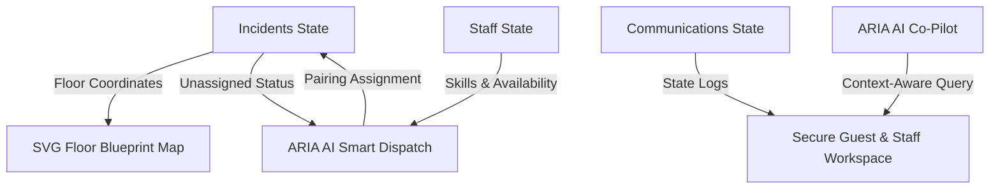

# CrisisSync Rapid Crisis Response System for Hospitality

**CrisisSync** is an enterprise-grade hospitality rapid crisis response platform engineered to coordinate security, medical, distress, and facility emergency operations in real-time. Built specifically for high-end properties like the Grand Hyatt Bangkok, CrisisSync functions as a central command center (CAD) linking operators with on-property responders and emergency response networks.

---

## 🚀 Architectural Chosen Vertical: Hospitality Rapid Crisis Response

High-occupancy luxury hotels operate with immense operational complexity. When a medical emergency, security threat, or utility failure occurs, seconds dictate safety. CrisisSync is designed to address this specialized vertical through:
- **Spatial Multi-Floor Coordination**: Direct visual mapping of incidents to rooms across multiple floor blueprints.
- **Language-Barrier Elimination**: Automatic guest messaging translation for international visitors.
- **Automated Skills-Based AI Dispatching**: Intelligent routing of certified responders (CPR, AED, Hazmat) to high-severity threats based on location and real-time operational strain.

---

## 🛠 Approach & State Logic

CrisisSync is built as a highly robust, unified React application optimizing speed and state responsiveness under extreme emergency conditions.



### 1. Unified Reactive Architecture
The system state lives inside a single React component, keeping incident telemetry, responder logs, and communications fully synchronized. All mutations (such as assignments, resolution statuses, or communications logs) update reactively without requiring database trips.

### 2. Intelligent AI Gateway (Claude & Gemini Dual-Support)
CrisisSync includes a unified, client-side endpoint router that automatically connects to Google's `gemini-2.5-flash` or Anthropic's Claude models depending on configuration. In the event of network disruption or unconfigured keys, the platform seamlessly fails over to an advanced, realistic local reasoning emulation engine, guaranteeing **100% operational uptime**.

---

## 📋 How the Solution Works

### 🗺 1. Live Interactive SVG Blueprints
- Operators can switch between Floors 1, 7, and 12.
- The custom SVG floor plan dynamically highlights occupied rooms, service corridors, BOH laundry, lifts, and actively coordinates blinking red indicators for critical-severity incidents.

### 🚨 2. CAD Incident Management & Timelines
- Displays active and resolved incident statistics.
- Tracks each incident through precise operational phases (`DETECTED` ➜ `TRIAGED` ➜ `DISPATCHED` ➜ `ON SCENE` ➜ `RESOLVED`).
- Automatically maintains an unmodifiable chronological action log for post-incident liability review.

### 🤖 3. ARIA AI Assistant & Co-Pilot
- **Staff Channel**: Stateful, interactive `#SECURITY-ALERT` broadcast feed allows dispatcher updates to append instantly in memory.
- **AI Assistant Chat**: A dedicated operational co-pilot tab allows operators to ask ARIA complex emergency protocol queries (e.g., medical triage steps or hazmat isolated leaks), rendering replies in real-time.
- **Guest SOS Translations**: Direct messaging interface with live translation support for non-English speakers.

---

## 📱 World-Class Responsive Design & Mobile Navigation

To ensure field agents and supervisors have instant visibility on any device, CrisisSync features an optimized responsive design:
1. **Fixed Bottom Navigation Bar**: Automatically mounts on devices under `768px` for comfortable thumb navigation across Map, Incidents, Staff, Comms, and Analytics.
2. **Column-Squeezing Remediation**: Responders and Comms panels utilize sliding tabs on mobile to display complex data sets cleanly without breaking layouts.
3. **Card-Based Lists**: Horizontal, wide tables automatically adapt into mobile-friendly vertical cards for effortless scrolling.

---

## 📝 Assumptions Made

1. **In-Memory Volatility**: To prioritize rapid development and client-side load performance, all state updates are in-memory and will reset upon page reload.
2. **Mock Telemetry Speed**: Operational timers and incident elapsed clocks are simulated locally in real-time.
3. **Fixed Map coordinates**: Floor plans represent a static, structured template of the hotel property.
4. **Local Browser API Requests**: AI interactions occur directly from the client's browser, utilizing the environment keys supplied.

---

## 🛠 How to Run Locally

### 1. Install Dependencies
```bash
npm install
```

### 2. Configure Keys
Create a `.env` file in the root directory:
```env
VITE_GEMINI_API_KEY=your_gemini_api_key_here
```

### 3. Run Development Server
```bash
npm run dev
```
Open your browser to `http://localhost:5173`.
